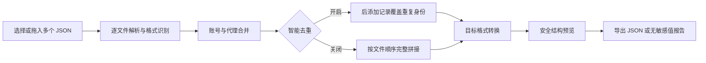

# Sub2API 账号迁移工具的开发手记

> 一次看似简单的字段改名，最后变成了格式考古、批量合并、去重策略和浏览器隐私边界的综合题。

项目地址：[LaplaceOrange/sub2api-json-converter](https://github.com/LaplaceOrange/sub2api-json-converter)

## 起点：两个都叫“账号导出”的 JSON

这个项目源于一个很具体的问题：在 [Wei-Shaw/sub2api](https://github.com/Wei-Shaw/sub2api) 的不同版本之间，账号 JSON 的外层结构看起来几乎没变，但认证字段已经换了一套表达方式。历史排查把版本分界定位到了 [`v0.1.72`](https://github.com/Wei-Shaw/sub2api/tree/v0.1.72)。

我拿到的两份真实样本分别是：

| 样本 | 账号数 | 代理数 | 识别结果 | 主要认证字段 |
|---|---:|---:|---|---|
| 旧版导出 | 2 | 0 | OAuth | `access_token`、`refresh_token`、`id_token` |
| 新版导出 | 250 | 0 | Agent Identity | `agent_runtime_id`、`agent_private_key`、`auth_mode` |

第一眼很容易把问题理解成“换两个键名”。真正打开数据后才发现，转换器至少还要回答四个问题：

1. 文件根节点不一定总是标准导出包，可能是账号数组、单个账号或多层 `data` 包装。
2. 账号配置中存在跨版本扩展字段，不能为了格式整齐而静默丢失。
3. 多份备份合并时可能出现同一账号，必须定义谁覆盖谁。
4. 输入包含 token 和私钥，网页不能把敏感值显示到预览、日志或报告里。

## 源码考古：两个 Agent Identity 字段实际参与了什么

为了避免只凭字段名猜测，我沿着 Sub2API 的服务端实现继续往下追。

在 [`openai_agent_identity.go`](https://github.com/Wei-Shaw/sub2api/blob/main/backend/internal/service/openai_agent_identity.go) 中：

- `agent_runtime_id` 会进入任务注册 URL，也会参与任务注册签名和 `AgentAssertion` 的签名载荷。
- `agent_private_key` 会先经过 Base64 解码，再按 PKCS#8 解析为 Ed25519 私钥，用于签名；代码还会从它派生密钥以解密服务端返回的 `encrypted_task_id`。
- 最终请求头不是普通的 `Bearer`，而是由 runtime ID、task ID、时间戳和签名组成的 `AgentAssertion`。

导入路径 [`account_codex_import.go`](https://github.com/Wei-Shaw/sub2api/blob/main/backend/internal/handler/admin/account_codex_import.go) 也会检查 runtime ID、私钥、account ID 和 user ID 是否齐全，并验证私钥格式。

转换器本身按照项目确认的迁移关系执行字段映射：

| 新版 Agent Identity | 旧版 OAuth | 方向 |
|---|---|---|
| `agent_runtime_id` | `access_token` | 双向 |
| `agent_private_key` | `refresh_token` | 双向 |
| `chatgpt_account_id` | `chatgpt_account_id` | 原样保留 |
| `chatgpt_user_id` | `chatgpt_user_id` | 原样保留 |
| `task_id` | `id_token` | 不互相映射 |

这里有一个刻意的边界：工具只执行已确认的字段对应，不自行发明 `task_id` 与 `id_token` 的关系。

## 为什么最终选择单文件网页

这是一个迁移工具，不需要数据库、账号系统或常驻服务。把它做成一个独立的 [`index.html`](./index.html) 有几个实际好处：

| 设计选择 | 带来的结果 |
|---|---|
| 无后端 | JSON 不离开本机浏览器 |
| 无第三方运行时依赖 | 下载后双击即可使用 |
| HTML、CSS、JavaScript 放在同一文件 | 方便离线保存和版本归档 |
| 纯函数承担解析、合并和转换 | 可以直接在 Node.js 中测试 |
| DOM 只负责交互和展示 | 核心逻辑不依赖浏览器界面 |

整个数据流可以概括为：



## 多文件合并：去重比拼接更难

数组拼接只需要一行代码，可靠的去重却需要稳定身份。当前实现按以下优先级为账号建立键：

| 优先级 | 字段 | 原因 |
|---:|---|---|
| 1 | `chatgpt_account_id` / `account_id` | 最接近账号主体 |
| 2 | `agent_runtime_id` | Agent Identity 的稳定运行时标识 |
| 3 | `chatgpt_user_id` / `user_id` | 可用于没有 account ID 的记录 |
| 4 | `email` | 最后的可读身份线索 |

没有稳定标识的账号不会仅凭 `name` 去重，因为两个不同账号完全可能使用相同显示名称。

代理则优先使用 `proxy_key`；没有该字段时，再组合 `protocol + host + port + username`。当重复项出现时，**后添加的文件优先**。这个规则很适合迁移场景：通常越晚加入的备份越新，也更可能包含完整字段。

如果用户确实需要保留所有记录，可以关闭“合并时智能去重”，工具会按照文件加入顺序完整拼接。

## 转换时如何避免字段污染

双向转换不是简单复制新字段。如果保留旧键，一个账号会同时带着 OAuth 和 Agent Identity 两套认证字段，后续导入器可能因此误判认证方式。

因此转换分两步进行：

1. 复制公共字段和允许保留的扩展字段。
2. 写入目标认证字段，并显式删除源认证字段。

例如 OAuth 转 Agent Identity 后，结果中会包含 `agent_runtime_id`、`agent_private_key` 和 `auth_mode: "agentIdentity"`，但不会继续保留 `access_token`、`refresh_token` 或 `id_token`。

“保留未知字段”选项只保护真正的扩展配置，不会破坏这条认证字段边界。

## 敏感数据：最重要的功能是“不做什么”

这个工具不会：

- 上传文件；
- 调用转换 API；
- 把账号内容写入 Local Storage 或 IndexedDB；
- 在结构预览中显示 token、私钥或密码；
- 在转换报告中写入凭据值。

文件通过浏览器的 File API 读取，只存在于当前页面内存中。结构预览只展示账号数量、认证类型和凭据键名；像 `access_token`、`refresh_token`、`id_token` 与 `agent_private_key` 只会显示为“敏感值”。

当然，最终导出的 JSON 仍包含真实凭据，因为这正是迁移文件的用途。下载后的文件应继续按敏感备份管理。

## 测试：不只确认“按钮能点”

仓库中的 [`tests/converter.test.cjs`](./tests/converter.test.cjs) 不依赖测试框架。它从 `index.html` 提取核心脚本，在 Node.js VM 中验证纯函数行为。

| 验证项 | 结果 |
|---|---|
| OAuth -> Agent Identity 字段映射 | 通过 |
| Agent Identity -> OAuth 字段映射 | 通过 |
| 目标结果不残留源认证字段 | 通过 |
| 多文件账号与代理去重 | 通过 |
| 后添加记录覆盖先前重复记录 | 通过 |
| 关闭去重后完整拼接 | 通过 |
| 预览不泄露敏感值 | 通过 |

真实样本还进行了浏览器端验证：

| 场景 | 输入 | 输出 |
|---|---:|---:|
| 两份文件合并后转新版 | 2 + 250 个账号 | 252 个 Agent Identity 账号 |
| 两份文件合并后转旧版 | 2 + 250 个账号 | 252 个 OAuth 账号 |
| 桌面布局 | 1440 × 900 | 无重叠、无控制台错误 |
| 移动布局 | 390 × 844 | 无横向溢出，长文件名正常换行 |

运行测试只需要：

```powershell
node .\tests\converter.test.cjs
```

## 几个开发中的小插曲

### 1. “选择多个文件”不等于“能够多次追加”

给 `<input type="file">` 增加 `multiple` 只能解决一次选择多个文件。为了支持用户分几次添加备份，页面还需要维护独立文件队列，并用 `name + size + lastModified` 阻止同一个文件被误加两次。

### 2. 全页截图里的重复页头并不是页面重复

自动化测试使用全页截图时，浏览器会分段拼接长页面。`position: sticky` 的页头可能在多个分段中重复出现。改用固定视口截图并检查 DOM 宽度后，确认这是截图拼接现象，不是页面渲染错误。


## 现在如何使用

1. 用浏览器打开 https://sub2.fsykk.cn 。
2. 一次选择多个 JSON，或分批拖入页面。
3. 查看每个文件的识别结果和合并统计。
4. 决定是否开启智能去重、保留未知字段和格式化输出。
5. 选择新版 Agent Identity 或旧版 OAuth。
6. 点击“合并并转换”，检查结构预览后下载 JSON。

## 写在最后

这个项目没有庞大的技术栈，核心代码甚至全部装在一个 HTML 文件里。但它处理的是一个典型的工程问题：**数据结构表面相似，语义和边界却藏在细节中**。

真正让工具可靠的，不是多写几个按钮，而是明确输入范围、保留策略、去重顺序、敏感信息边界和可重复验证的方法。对迁移工具来说，“结果可解释”往往和“结果正确”同样重要。

欢迎在 [Issues](https://github.com/LaplaceOrange/sub2api-json-converter/issues) 中提交新的样本结构或兼容性问题，但请务必先移除 token、私钥和其他真实凭据。
